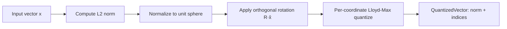
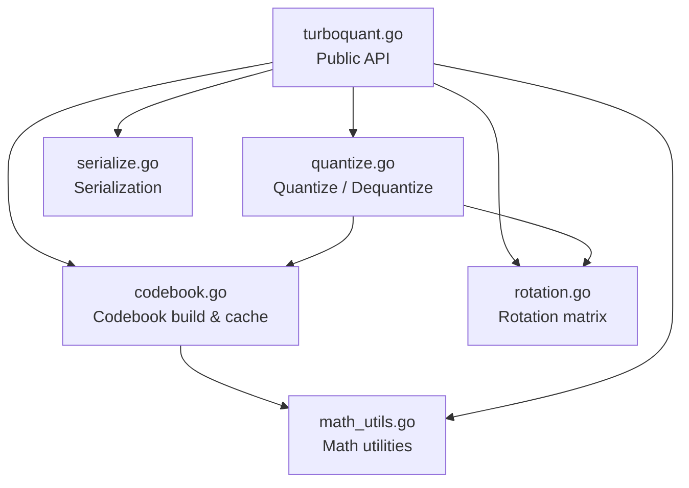

# TurboQuant

English | [中文文档](README_zh.md)

[](https://pkg.go.dev/github.com/mredencom/turboquant)
[](https://github.com/mredencom/turboquant/actions/workflows/ci.yml)
[](https://goreportcard.com/report/github.com/mredencom/turboquant)
[](https://opensource.org/licenses/MIT)
[](https://github.com/mredencom/turboquant/blob/main/go.mod)

A Go library implementing the TurboQuant online vector quantization algorithm ([arXiv:2504.19874](https://arxiv.org/abs/2504.19874)). It compresses float32 vectors to 2/3/4-bit representations using random orthogonal rotation and Lloyd-Max scalar quantization on the Beta distribution — no training data required.

## Features

- 2-bit, 3-bit, and 4-bit quantization
- Data-oblivious: works without training data
- Concurrent batch quantize/dequantize via goroutines
- Compact binary serialization (bit-packed)
- Codebook auto-caching (thread-safe)
- Deterministic: same seed → same results

## Install

```bash
go get github.com/mredencom/turboquant@latest
```

## Quick Start

```go
package main

import (
    "fmt"
    "github.com/mredencom/turboquant"
)

func main() {
    // Create a 4-bit quantizer for 128-dimensional vectors
    tq, err := turboquant.NewTurboQuant(128, turboquant.Bit4, 42)
    if err != nil {
        panic(err)
    }

    // Quantize
    vec := make([]float32, 128)
    for i := range vec {
        vec[i] = float32(i) * 0.01
    }
    qv, _ := tq.Quantize(vec)

    // Serialize → Deserialize
    data, _ := tq.Serialize(qv)
    qv2, _ := tq.Deserialize(data)

    // Dequantize
    restored, _ := tq.Dequantize(qv2)

    // Check quality
    sim, _ := turboquant.CosineSimilarity(vec, restored)
    fmt.Printf("Cosine similarity: %.4f\n", sim)
    fmt.Printf("Compression ratio: %.1fx\n", tq.CompressionRatio())
}
```

## API

| Method | Description |
|---|---|
| `NewTurboQuant(dimension, bitWidth, seed)` | Create a quantizer instance |
| `Quantize(vec)` | Quantize a single float32 vector |
| `Dequantize(qv)` | Reconstruct a float32 vector |
| `QuantizeBatch(vecs)` | Batch quantize (concurrent) |
| `DequantizeBatch(qvs)` | Batch dequantize (concurrent) |
| `Serialize(qv)` | Serialize to compact binary |
| `Deserialize(data)` | Deserialize from binary |
| `CompressionRatio()` | Get theoretical compression ratio |
| `CosineSimilarity(a, b)` | Compute cosine similarity between two vectors |

## How It Works

1. Compute L2 norm and normalize the input vector
2. Apply a random orthogonal rotation (QR decomposition)
3. Quantize each rotated coordinate using a Lloyd-Max codebook optimized for the Beta distribution
4. Store the norm (float32) + quantized indices (bit-packed)

Dequantization reverses the process: look up centroids → inverse rotation → scale by norm.

### Quantization Pipeline



### Module Dependencies



## Project Structure

```
turboquant.go      Public API: NewTurboQuant, Quantize, Dequantize, Batch, Serialize
codebook.go        Lloyd-Max codebook builder with cache
rotation.go        Random orthogonal matrix via QR decomposition
quantize.go        Core quantize/dequantize logic
serialize.go       Bit-packed binary serialization
math_utils.go      Beta PDF, cosine similarity, compression ratio
convert.go         Type conversion helpers (float64, int, byte, string → float32)
```

## Testing

```bash
go test -v ./...
```

50 tests including property-based tests for correctness properties:
- Codebook centroid count = 2^bitWidth
- Rotation matrix orthogonality (R^T·R ≈ I)
- Rotation reproducibility (same seed → same matrix)
- Quantize-dequantize cosine similarity thresholds
- Serialization round-trip consistency

## Benchmarks

Measured on Apple M4 (darwin/arm64), Go 1.24, pure Go BLAS backend.

Run benchmarks yourself:

```bash
go test -bench=BenchmarkQuantize -benchmem -benchtime=1s -run='^$' .
go test -bench=BenchmarkDequantize -benchmem -benchtime=1s -run='^$' .
```

### Single-Vector Quantize

| Dimension | 2-bit | 3-bit | 4-bit |
|-----------|-------|-------|-------|
| 128 | 33.8 µs | 32.4 µs | 35.4 µs |
| 256 | 183 µs | 161 µs | 161 µs |
| 512 | 709 µs | 678 µs | 742 µs |
| 1024 | 3.26 ms | 3.36 ms | 4.42 ms |

### Single-Vector Dequantize

| Dimension | 2-bit | 3-bit | 4-bit |
|-----------|-------|-------|-------|
| 128 | 21.6 µs | 17.6 µs | 18.3 µs |
| 256 | 71.7 µs | 68.4 µs | 61.7 µs |
| 512 | 304 µs | 297 µs | 263 µs |
| 1024 | 1.30 ms | 1.47 ms | 1.23 ms |

### Batch Quantize (dim=256, 4-bit)

| Batch Size | Time | Allocs |
|------------|------|--------|
| 100 | 6.21 ms | 907 |
| 1,000 | 40.1 ms | 9,034 |
| 10,000 | 387 ms | 90,079 |

### Serialize / Deserialize (dim=256)

| Operation | 2-bit | 3-bit | 4-bit |
|-----------|-------|-------|-------|
| Serialize | 322 ns | 1.03 µs | 445 ns |
| Deserialize | 770 ns | 1.09 µs | 721 ns |

## Performance Tuning

By default, TurboQuant uses gonum's pure Go BLAS backend — no CGO or system libraries required. For large dimensions (≥ 512), you can link [OpenBLAS](https://github.com/OpenMathLib/OpenBLAS) or Intel MKL for 2–6× faster matrix-vector operations:

```go
import _ "gonum.org/v1/gonum/blas/cgo"  // activate native BLAS
```

```bash
# macOS
brew install openblas
CGO_ENABLED=1 go build ./...

# Linux
sudo apt-get install libopenblas-dev
CGO_ENABLED=1 go build ./...
```

For dimensions ≤ 256, the pure Go backend is typically fast enough. See [docs/BLAS.md](docs/BLAS.md) for full benchmarks, MKL setup, and detailed guidance.

## License

This project is licensed under the [MIT License](LICENSE).
