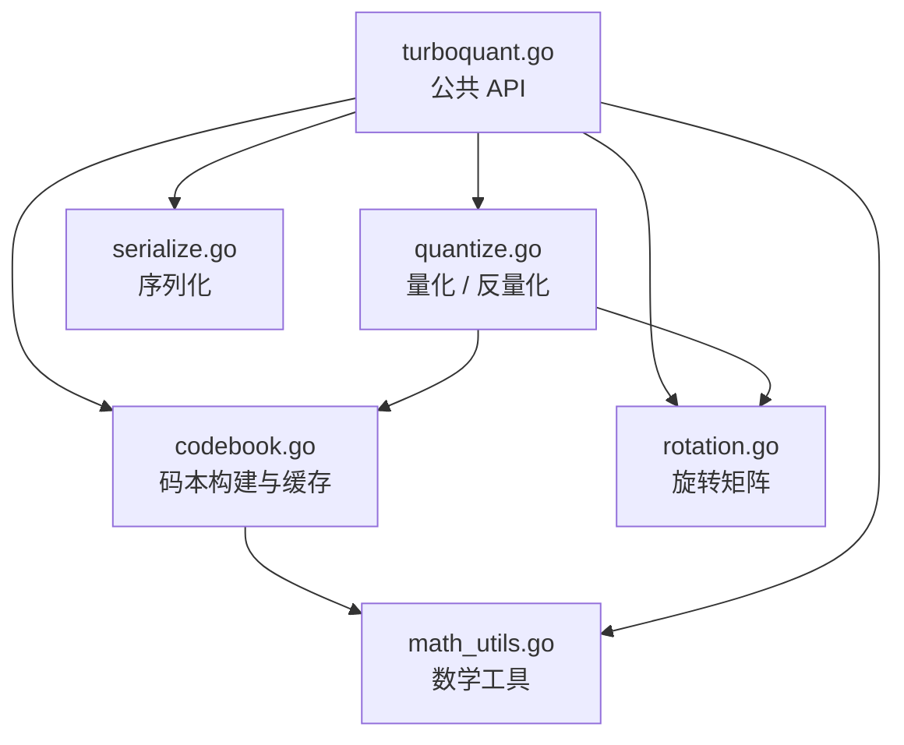

# TurboQuant

[](https://pkg.go.dev/github.com/mredencom/turboquant)
[](https://github.com/mredencom/turboquant/actions/workflows/ci.yml)
[](https://goreportcard.com/report/github.com/mredencom/turboquant)
[](https://opensource.org/licenses/MIT)
[](https://github.com/mredencom/turboquant/blob/main/go.mod)

一个 Go 语言库，实现了 TurboQuant 在线向量量化算法（[arXiv:2504.19874](https://arxiv.org/abs/2504.19874)）。通过随机正交旋转和基于 Beta 分布的 Lloyd-Max 标量量化器，将 float32 向量压缩为 2/3/4 bit 表示，无需训练数据。

## 特性

- 支持 2-bit、3-bit、4-bit 量化
- 数据无关（data-oblivious）：无需训练数据即可工作
- 批量量化/反量化支持 goroutine 并发
- 紧凑二进制序列化（比特紧凑排列）
- 码本自动缓存（线程安全）
- 确定性：相同种子产生相同结果

## 安装

```bash
go get github.com/mredencom/turboquant@latest
```

## 快速开始

```go
package main

import (
    "fmt"
    "github.com/mredencom/turboquant"
)

func main() {
    // 创建 128 维、4-bit 量化器
    tq, err := turboquant.NewTurboQuant(128, turboquant.Bit4, 42)
    if err != nil {
        panic(err)
    }

    // 量化
    vec := make([]float32, 128)
    for i := range vec {
        vec[i] = float32(i) * 0.01
    }
    qv, _ := tq.Quantize(vec)

    // 序列化 → 反序列化
    data, _ := tq.Serialize(qv)
    qv2, _ := tq.Deserialize(data)

    // 反量化
    restored, _ := tq.Dequantize(qv2)

    // 检查质量
    sim, _ := turboquant.CosineSimilarity(vec, restored)
    fmt.Printf("余弦相似度: %.4f\n", sim)
    fmt.Printf("压缩率: %.1fx\n", tq.CompressionRatio())
}
```

## API

| 方法 | 说明 |
|---|---|
| `NewTurboQuant(dimension, bitWidth, seed)` | 创建量化器实例 |
| `Quantize(vec)` | 量化单个 float32 向量 |
| `Dequantize(qv)` | 反量化，恢复 float32 向量 |
| `QuantizeBatch(vecs)` | 批量量化（并发执行） |
| `DequantizeBatch(qvs)` | 批量反量化（并发执行） |
| `Serialize(qv)` | 序列化为紧凑二进制 |
| `Deserialize(data)` | 从二进制反序列化 |
| `CompressionRatio()` | 获取理论压缩率 |
| `CosineSimilarity(a, b)` | 计算两个向量的余弦相似度 |

## 算法原理

1. 计算输入向量的 L2 范数并归一化到单位球面
2. 应用随机正交旋转（通过 QR 分解生成）
3. 对旋转后的每个坐标，使用针对 Beta 分布优化的 Lloyd-Max 码本进行标量量化
4. 存储范数（float32）+ 量化索引（比特紧凑排列）

反量化过程相反：查表得质心值 → 逆旋转 → 乘以范数。

### 量化流水线


### 模块依赖关系



## 项目结构

```
turboquant.go      公共 API：NewTurboQuant、Quantize、Dequantize、批量操作、序列化
codebook.go        Lloyd-Max 码本构建器与缓存
rotation.go        随机正交矩阵（QR 分解）
quantize.go        量化/反量化核心逻辑
serialize.go       比特紧凑二进制序列化
math_utils.go      Beta 分布 PDF、余弦相似度、压缩率计算
convert.go         类型转换工具（float64、int、byte、string → float32）
```

## 测试

```bash
go test -v ./...
```

包含 80 多个测试，其中有属性测试验证以下正确性性质：
- 码本质心数量 = 2^bitWidth
- 旋转矩阵正交性（R^T·R ≈ I）
- 旋转矩阵可复现性（相同种子 → 相同矩阵）
- 量化-反量化余弦相似度阈值
- 序列化往返一致性

## 基准测试

测试环境：Apple M4 (darwin/arm64)，Go 1.24，纯 Go BLAS 后端。

自行运行基准测试：

```bash
go test -bench=BenchmarkQuantize -benchmem -benchtime=1s -run='^$' .
go test -bench=BenchmarkDequantize -benchmem -benchtime=1s -run='^$' .
```

### 单向量量化

| 维度 | 2-bit | 3-bit | 4-bit |
|------|-------|-------|-------|
| 128 | 33.8 µs | 32.4 µs | 35.4 µs |
| 256 | 183 µs | 161 µs | 161 µs |
| 512 | 709 µs | 678 µs | 742 µs |
| 1024 | 3.26 ms | 3.36 ms | 4.42 ms |

### 单向量反量化

| 维度 | 2-bit | 3-bit | 4-bit |
|------|-------|-------|-------|
| 128 | 21.6 µs | 17.6 µs | 18.3 µs |
| 256 | 71.7 µs | 68.4 µs | 61.7 µs |
| 512 | 304 µs | 297 µs | 263 µs |
| 1024 | 1.30 ms | 1.47 ms | 1.23 ms |

### 批量量化（dim=256，4-bit）

| 批量大小 | 耗时 | 内存分配次数 |
|----------|------|-------------|
| 100 | 6.21 ms | 907 |
| 1,000 | 40.1 ms | 9,034 |
| 10,000 | 387 ms | 90,079 |

### 序列化 / 反序列化（dim=256）

| 操作 | 2-bit | 3-bit | 4-bit |
|------|-------|-------|-------|
| 序列化 | 322 ns | 1.03 µs | 445 ns |
| 反序列化 | 770 ns | 1.09 µs | 721 ns |

## 性能调优

默认情况下，TurboQuant 使用 gonum 的纯 Go BLAS 后端，无需 CGO 或系统库。对于高维向量（≥ 512），可以链接 [OpenBLAS](https://github.com/OpenMathLib/OpenBLAS) 或 Intel MKL，矩阵-向量运算可获得 2–6 倍加速：

```go
import _ "gonum.org/v1/gonum/blas/cgo"  // 启用原生 BLAS
```

```bash
# macOS
brew install openblas
CGO_ENABLED=1 go build ./...

# Linux
sudo apt-get install libopenblas-dev
CGO_ENABLED=1 go build ./...
```

对于维度 ≤ 256 的场景，纯 Go 后端通常已足够快。详细的基准测试、MKL 配置及完整指南请参阅 [docs/BLAS.md](docs/BLAS.md)。

## 许可证

本项目基于 [MIT 许可证](LICENSE) 开源。
